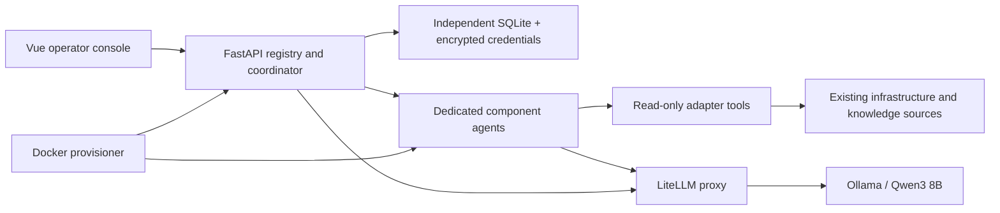

# Architecture

InfraAxon connects to existing infrastructure. It provisions its own diagnostic agents, never the infrastructure being diagnosed.

- Platform API and coordinator: Python/FastAPI; SQLite holds independent durable configuration, investigations and evidence.
- Operator console: Vue 3, TypeScript and Vite.
- Agent runtime: one container per registered component, common image with typed adapters.
- Provisioner: reconciles only containers labelled as owned by this installation; only this service accesses the Docker socket.
- Inference: local Ollama through LiteLLM. No cloud fallback.
- Integrations: MongoDB, Redis, S3/MinIO, Kafka, HTTP applications, OpenProject Community, Wiki.js, Mattermost, Elasticsearch, Kibana, PostgreSQL, Prometheus and Grafana.
- Read-only diagnosis with evidence references; no model-driven remediation.
- The separately deployed C#/ASP.NET Core shop demonstrates catalog, cache, images, orders and event processing.

OpenProject replaces Jira; Wiki.js replaces Confluence. No Atlassian license is required.

## Request flow

Registration persists a component's type, endpoint, settings, dependencies and encrypted secrets. The provisioner polls desired state every ten seconds and reconciles only containers bearing its ownership label. Each enabled component receives its own token; another component's token cannot fetch its configuration. Runtime containers are non-root, have a read-only filesystem and do not mount the Docker socket.

Agents refresh configuration and collect a heartbeat every thirty seconds. A direct diagnosis calls one agent. An environment investigation selects the requested component and graph neighbours, or uses keyword overlap when no target was given, capped at four agents. Results are persisted after each specialist and synthesized against their evidence IDs. Investigations are serialized per platform process to avoid overloading the shared local model.

Tools return source, operation, timestamp, duration, success flag, redacted data and a unique evidence ID. The model can request up to three rounds of bounded tool calls. Every hypothesis must reference existing observations. Invalid output triggers a limited repair attempt; failure retains the evidence and marks the investigation partial. A valid evidence ID verifies provenance, not correctness of interpretation.

Knowledge-source agents search live API data without a vector database. They are not automatically added to every investigation. Select a source or explicitly connect it in the graph to consult its runbooks/history. A production coordinator would need better source selection, retrieval and evaluation.

## Independent demonstration

Catalog.Api reads MongoDB, uses Redis with a thirty-second TTL and falls back to MongoDB on cache failure. It serves images from MinIO. Orders.Api validates prices server-side and stores each order together with its outbox state in one MongoDB document. A retrying publisher delivers Kafka events; the worker consumes them, simulates processing and updates order status. Idempotency keys reject conflicting HTTP requests. Kafka delivery is at-least-once; repeated completed events are harmless in this simulated workflow.

OpenTelemetry forwards application logs and traces to Elasticsearch through the collector. Prometheus collects metrics from the collector and exporters; Grafana dashboards and a Kibana data view are provisioned. The separate fault controller changes Toxiproxy paths and temporarily pauses the worker. It has its own authorization and resets faults after a bounded TTL.

## Extension points and boundaries

Add an adapter by registering its type and fields, implementing a bounded read operation and verifying it against a real service. No shop domain types are used by the platform. Agents can reach remote endpoints, but deployment currently supports one Docker engine; there is no Kubernetes operator, multi-user tenancy, RBAC administration or secret manager integration yet.

All example components share a Docker network. Tokens and tools provide application-level scope, not a network-isolation boundary against compromised agent code. Only the provisioner has Docker administration access. Workstation-facing ports bind to loopback.
